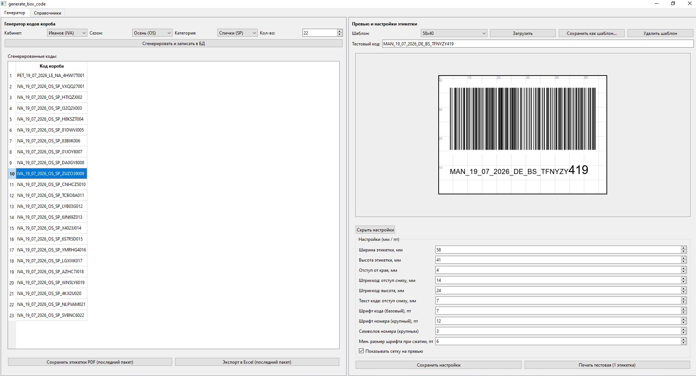
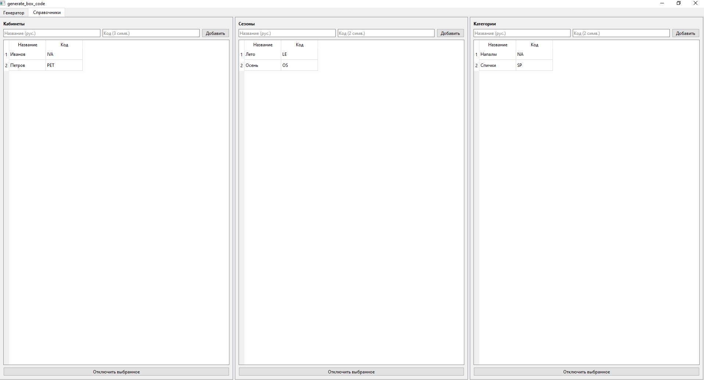

# generate_box_code

Генератор уникальных кодов коробов (упаковки) для Wildberries -
десктоп-инструмент с локальной БД для проверки уникальности уже
напечатанных кодов.

Это часть более крупного портфолио-проекта интеграций с российскими
маркетплейсами и логистическими сервисами (Wildberries, Ozon, Lamoda,
МойСклад, Деловые Линии) - каждый инструмент решает отдельную
операционную задачу продавца и живёт в своём репозитории.

## Какую проблему решает

С появлением привязки штрихкода короба к конкретному городу/складу
в системе Wildberries возникла операционная проблема: короба,
промаркированные заранее или на другом складе, требуют перемаркировки
при несовпадении с текущей точкой отгрузки. Это увеличивает количество
ручных операций и время на передачу данных о ШК складу.

В качестве решения тестируется подход с самостоятельной генерацией
кодов коробов, не привязанных к конкретному складу на момент создания.
Код формируется прямо во время сборки заказа и заносится в локальную
таблицу учёта, без ожидания подтверждения от склада или системы WB.

**Ожидаемый эффект:** снижение операционных затрат времени на 15-30%
в зависимости от используемой системы мониторинга и планирования
поставок и их частотности - за счёт исключения шага перемаркировки
и сокращения ручных передач данных между этапом сборки и складом.

## Что умеет приложение

- Генерирует коды коробов по заданному формату и сразу записывает их
  в локальную SQLite-базу
- **Гарантирует уникальность на уровне логики: одинаковый код в базе
  не может появиться дважды и, соответственно, физически не может быть
  распечатан дважды** - проверка идёт до записи, регистронезависимо
  (WB считает `AbCdEfG` и `abcdefg` одним и тем же кодом)
- Справочники кабинетов/сезонов/категорий - редактируемые, с
  подсказкой латинского кода по русскому названию (транслитерация)
- Печать этикеток: штрихкод Code128 + текст кода, с автоподгонкой
  шрифта под ширину этикетки, крупным шрифтом для последних цифр
  номера (чтобы было видно издалека без сканера)
- Живое превью этикетки с миллиметровой сеткой прямо в интерфейсе
- **Именованные шаблоны настроек этикетки (пресеты)** - можно
  сохранить несколько конфигураций (например, под разные размеры
  этикеток или разные типы товара) и переключаться между ними одной
  кнопкой, не перебивая поля вручную каждый раз
- Экспорт сгенерированных кодов в Excel (список) и в PDF (этикетки,
  по одной на страницу или общим файлом)

## Скриншоты

### Главный интерфейс (Генератор)

Слева - выбор кабинета/сезона/категории, генерация и список уже
записанных в базу кодов. Справа - живое превью этикетки и её настройки
(включая переключение между сохранёнными шаблонами).

### Справочники

Кабинеты, сезоны и категории - редактируемые списки с подсказкой
латинского кода по русскому названию.

## Требования Wildberries к коду короба

- длина 6-30 символов
- не начинается с `WB`
- без пробелов
- только латинские буквы, цифры, `-`, `_`
- уникальность регистронезависимая (`AbCdEfG` = `abcdefg`)
- рекомендуется делать код длинным и сложным - риск случайного
  совпадения с чужим кодом действует на всей платформе, не только
  внутри одного продавца

## Формат кода
CABINET_dd_MM_YYYY_SEASON_ITEM_RANDOMSEQ

Пример: `ALF_16_07_2026_DE_BT_R4N001`

- `CABINET` - код кабинета из справочника (первые 3 символа названия,
  например условный кабинет "Альфа" -> `ALF`)
- `dd_MM_YYYY` - дата генерации
- `SEASON` - код сезона (2 символа)
- `ITEM` - код категории (2 символа, предпочтительно согласные:
  BT, LF, TF, BL - лучше читаются)
- `RANDOMSEQ` - без разделителя внутри: случайные буквенно-цифровые
  символы + порядковый номер. Номер не ограничен сверху - ширина
  (кол-во цифр) растёт сама по мере роста значения (001..999, затем
  1000, 1001...). Случайная часть занимает весь оставшийся бюджет
  длины кода (минимум 3 символа энтропии).

Порядковый номер - общий счётчик на кабинет за сутки (сбрасывается
на новый день), не зависит от категории или сезона.

## Архитектура (по слоям)

1. **БД (SQLite)** - справочники `cabinets`, `seasons`, `item_types`
   (с флагом `is_active` для мягкого отключения без потери истории),
   основная таблица `box_codes` - история сгенерированных кодов
2. **Справочники (CRUD)** - редактирование через GUI, поле ввода
   принимает кириллицу/латиницу/цифры, транслитерация в латинский код
   с возможностью ручной правки перед сохранением
3. **Генератор** - выбор кабинета/сезона/категории из кэша, немедленная
   генерация и запись в БД, с безусловным пропуском случайных дублей
   (не записываются и не попадают на печать ни при каких условиях)
4. **Этикетка** - штрихкод Code128, настраиваемые позиции текста/ШК,
   автоподгонка шрифта под ширину этикетки, именованные шаблоны
   настроек, живое превью с миллиметровой сеткой
5. **История** - просмотр всех сгенерированных кодов с датой и
   привязкой к кабинету/сезону/категории
6. **Экспорт** - Excel (список кодов), PDF (этикетки)

## Стек

- Python 3.11+
- GUI: PySide6
- БД: SQLite
- Штрихкод/PDF: reportlab (печать), python-barcode (превью в GUI)
- Excel: openpyxl

## Статус

MVP реализован и рабочий: генерация, БД, справочники, GUI, печать
этикеток, экспорт. Покрыто юнит- и интеграционными тестами.

## Установка
pip install -r requirements.txt

## Запуск
python src\main.py
