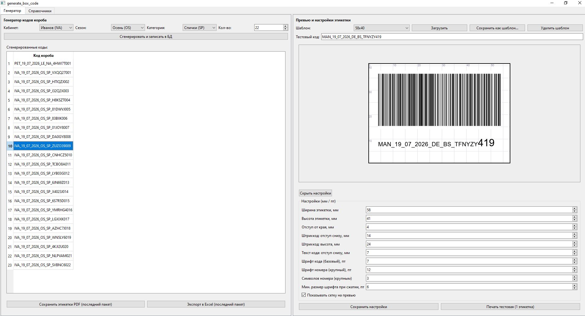
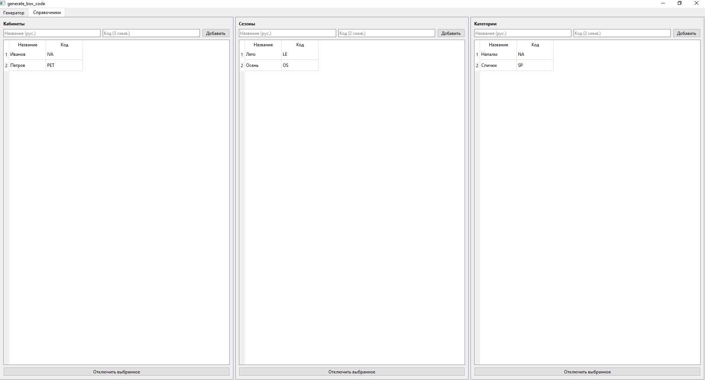
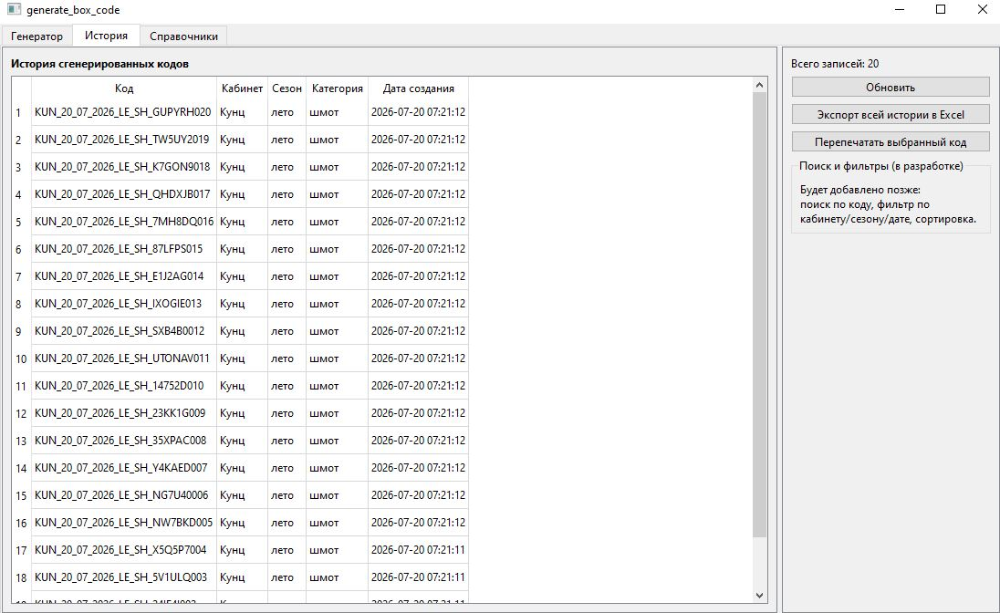

# generate_box_code

Генератор уникальных кодов коробов (упаковки) для Wildberries -
десктоп-инструмент с локальной БД для проверки уникальности уже
напечатанных кодов.

Это часть более крупного портфолио-проекта интеграций с российскими
маркетплейсами и логистическими сервисами (Wildberries, Ozon, Lamoda,
МойСклад, Деловые Линии) - каждый инструмент решает отдельную
операционную задачу продавца и живёт в своём репозитории.

## Какую проблему решает

С появлением привязки штрихкода короба к конкретному городу/складу
в системе Wildberries возникла операционная проблема: короба,
промаркированные заранее или на другом складе, требуют перемаркировки
при несовпадении с текущей точкой отгрузки. Это увеличивает количество
ручных операций и время на передачу данных о ШК складу.

В качестве решения тестируется подход с самостоятельной генерацией
кодов коробов, не привязанных к конкретному складу на момент создания.
Код формируется прямо во время сборки заказа и заносится в локальную
таблицу учёта, без ожидания подтверждения от склада или системы WB.

**Ожидаемый эффект:** снижение операционных затрат времени на 15-30%
в зависимости от используемой системы мониторинга и планирования
поставок и их частотности - за счёт исключения шага перемаркировки
и сокращения ручных передач данных между этапом сборки и складом.

## Что умеет приложение

- Генерирует коды коробов по заданному формату и сразу записывает их
  в локальную SQLite-базу
- Гарантирует уникальность на уровне логики: одинаковый код в базе
  не может появиться дважды и, соответственно, физически не может быть
  распечатан дважды - проверка идёт до записи, регистронезависимо
  (WB считает AbCdEfG и abcdefg одним и тем же кодом)
- Справочники кабинетов/сезонов/категорий - редактируемые, с
  подсказкой латинского кода по русскому названию (транслитерация)
- Печать этикеток: штрихкод Code128 + текст кода, с автоподгонкой
  шрифта под ширину этикетки, крупным шрифтом для последних цифр
  номера (чтобы было видно издалека без сканера)
- Живое превью этикетки с миллиметровой сеткой прямо в интерфейсе
- Именованные шаблоны настроек этикетки (пресеты) - можно сохранить
  несколько конфигураций и переключаться между ними одной кнопкой
- История - просмотр всех сгенерированных кодов (кабинет, сезон,
  категория, дата), построена на модели данных (не на виджете),
  поэтому не подвисает даже на тысячах записей
- Перепечатка существующего кода - если физическая этикетка
  повреждена или потеряна, можно распечатать PDF того же самого кода
  ещё раз, без создания нового кода и без изменения базы
- Экспорт в Excel (список кодов текущей генерации или вся история) и
  в PDF (этикетки, по одной на страницу)

Намеренно нет функции очистки истории прямо в приложении: сброс базы
задним числом ломает проверку уникальности и создаёт риск повторной
печати уже использованного кода на реальном складе.

## Скриншоты

### Главный интерфейс (Генератор)


Слева - выбор кабинета/сезона/категории, генерация и список уже
записанных в базу кодов. Справа - живое превью этикетки и её настройки
(включая переключение между сохранёнными шаблонами).

### Справочники


Кабинеты, сезоны и категории - редактируемые списки с подсказкой
латинского кода по русскому названию.

### История


Список всех сгенерированных кодов с кабинетом/сезоном/категорией/датой,
кнопки обновления, экспорта в Excel и перепечатки выбранного кода.

## Хранение данных и очистка

Расположение базы и настроек зависит от способа запуска:

- Запуск из исходников (python src\main.py) - файлы box_codes.db,
  label_settings.json, label_presets.json лежат рядом с кодом, в src\
- Запуск собранного .exe - файлы лежат в постоянной пользовательской
  директории: на Windows это %APPDATA%\generate_box_code, на macOS
  ~/Library/Application Support/generate_box_code, на Linux
  ~/.local/share/generate_box_code

Это разделение существует из-за особенности PyInstaller --onefile:
при каждом запуске собранный .exe распаковывается во временную папку,
которая создаётся заново при каждом старте. Если хранить данные "рядом
с кодом" (как удобно при разработке), в собранной версии они физически
оказываются в новой временной папке при каждом запуске и полностью
теряются при следующем - именно так вела себя первая версия .exe
(справочники и история "пропадали" после закрытия окна). Исправлено
переносом хранения в постоянную директорию для собранной версии.

### Как очистить базу (если понадобится)

Кнопки очистки в самом приложении намеренно нет. Причина: если
сбросить историю уже после того, как какие-то коды были распечатаны и
наклеены на реальные короба, приложение "забудет", что эти коды заняты,
и сможет выдать точно такой же код повторно - а это ломает саму цель
инструмента (гарантию уникальности на всей платформе WB). Поэтому
очистка - осознанное ручное действие вне интерфейса, а не кнопка,
которую можно случайно нажать.

Правила очистки:
1. Приложение должно быть полностью закрыто (SQLite не даст удалить
   файл при открытом соединении)
2. Очищать историю имеет смысл только если ни один из сгенерированных
   кодов ещё не был физически использован (наклеен на короб), либо
   если это тестовая/демонстрационная база, а не рабочая

Полная очистка (база + справочники + настройки этикетки) для
собранного .exe:
```powershell
Remove-Item "$env:APPDATA\generate_box_code" -Recurse -Force
```

Очистка только истории и справочников, настройки этикетки остаются:
```powershell
Remove-Item "$env:APPDATA\generate_box_code\box_codes.db" -Force
```

При запуске из исходников - те же действия, но путь src\box_codes.db
вместо %APPDATA%\generate_box_code\box_codes.db.

## Требования Wildberries к коду короба

- длина 6-30 символов
- не начинается с WB
- без пробелов
- только латинские буквы, цифры, -, _
- уникальность регистронезависимая (AbCdEfG = abcdefg)
- рекомендуется делать код длинным и сложным - риск случайного
  совпадения с чужим кодом действует на всей платформе, не только
  внутри одного продавца

## Формат кода

CABINET_dd_MM_YYYY_SEASON_ITEM_RANDOMSEQ

Пример: ALF_16_07_2026_DE_BT_R4N001

- CABINET - код кабинета из справочника (первые 3 символа названия,
  например условный кабинет "Альфа" -> ALF)
- dd_MM_YYYY - дата генерации
- SEASON - код сезона (2 символа)
- ITEM - код категории (2 символа, предпочтительно согласные:
  BT, LF, TF, BL - лучше читаются)
- RANDOMSEQ - без разделителя внутри: случайные буквенно-цифровые
  символы + порядковый номер. Номер не ограничен сверху - ширина
  (кол-во цифр) растёт сама по мере роста значения (001..999, затем
  1000, 1001...). Случайная часть занимает весь оставшийся бюджет
  длины кода (минимум 3 символа энтропии).

Порядковый номер - общий счётчик на кабинет за сутки (сбрасывается
на новый день), не зависит от категории или сезона.

## Архитектура (по слоям)

1. БД (SQLite) - справочники cabinets, seasons, item_types
   (с флагом is_active для мягкого отключения без потери истории),
   основная таблица box_codes - история сгенерированных кодов
2. Справочники (CRUD) - редактирование через GUI, поле ввода
   принимает кириллицу/латиницу/цифры, транслитерация в латинский код
   с возможностью ручной правки перед сохранением
3. Генератор - выбор кабинета/сезона/категории из кэша, немедленная
   генерация и запись в БД, с безусловным пропуском случайных дублей
   (не записываются и не попадают на печать ни при каких условиях)
4. Этикетка - штрихкод Code128, настраиваемые позиции текста/ШК,
   автоподгонка шрифта под ширину этикетки, именованные шаблоны
   настроек, живое превью с миллиметровой сеткой
5. История - просмотр всех сгенерированных кодов (модель/представление,
   не подвисает на больших объёмах), перепечатка существующего кода,
   экспорт полной истории в Excel
6. Экспорт - Excel (список кодов), PDF (этикетки)

## Стек

- Python 3.11+
- GUI: PySide6
- БД: SQLite
- Штрихкод/PDF: reportlab (печать), python-barcode (превью в GUI)
- Excel: openpyxl

## Статус

v1.0 - реализован и рабочий: генерация, БД, справочники, GUI, печать
этикеток, история, перепечатка, экспорт. Покрыто юнит- и
интеграционными тестами.

## Установка

```
pip install -r requirements.txt
```

## Запуск

```
python src\main.py
```
