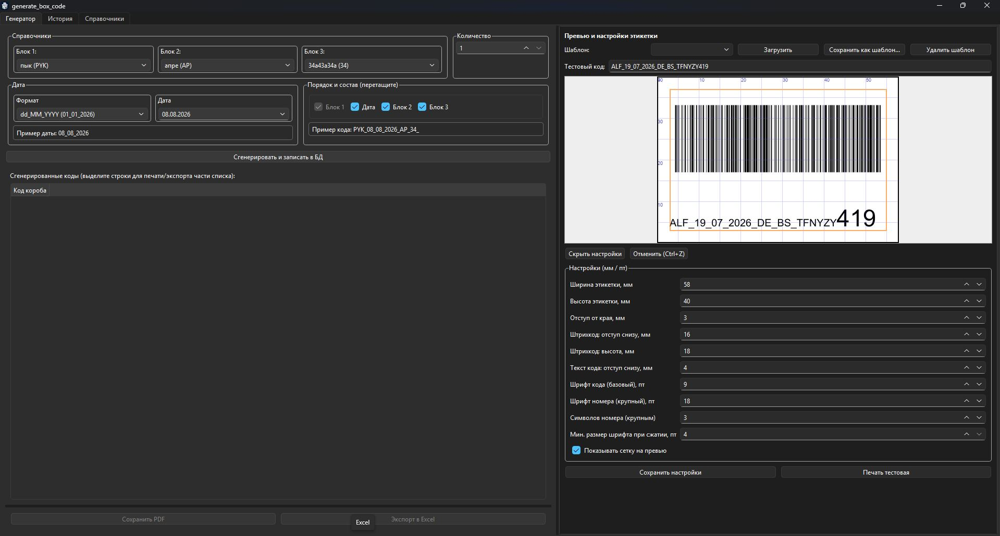
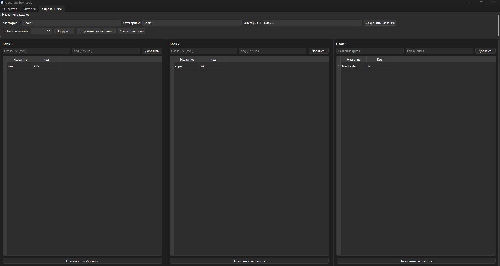
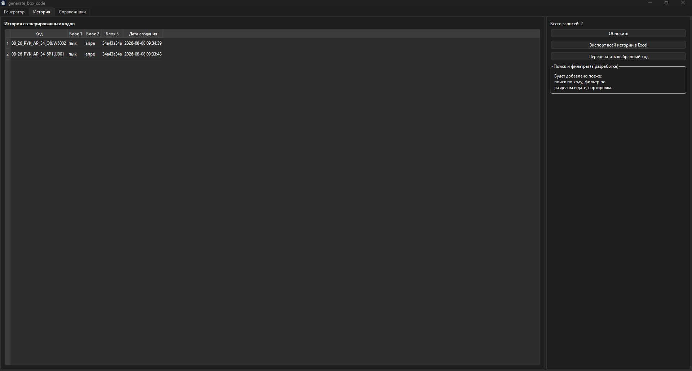

# generate_box_code

Генератор уникальных кодов коробов (упаковки) для складской маркировки —
десктоп-инструмент с локальной БД для проверки уникальности уже
напечатанных кодов. Исходно создан под Wildberries, но формат кода
гибкий и подходит для общескладских сценариев маркировки штрихкодом
Code128.

Это часть более крупного портфолио-проекта интеграций с российскими
маркетплейсами и логистическими сервисами (Wildberries, Ozon, Lamoda,
МойСклад, Деловые Линии) — каждый инструмент решает отдельную
операционную задачу продавца и живёт в своём репозитории.

## Какую проблему решает

С появлением привязки штрихкода короба к конкретному городу/складу
в системе Wildberries возникла операционная проблема: короба,
промаркированные заранее или на другом складе, требуют перемаркировки
при несовпадении с текущей точкой отгрузки. Это увеличивает количество
ручных операций и время на передачу данных о ШК складу.

В качестве решения тестируется подход с самостоятельной генерацией
кодов коробов, не привязанных к конкретному складу на момент создания.
Код формируется прямо во время сборки заказа и заносится в локальную
таблицу учёта, без ожидания подтверждения от склада или системы WB.

Тот же подход применим и к общескладской маркировке: инструмент
генерирует уникальные коды нужного формата и печатает по ним этикетки
Code128 — независимо от того, требует ли их конкретный маркетплейс.

**Ожидаемый эффект:** снижение операционных затрат времени на 15-30%
в зависимости от используемой системы мониторинга и планирования
поставок и их частотности — за счёт исключения шага перемаркировки
и сокращения ручных передач данных между этапом сборки и складом.

## Что умеет приложение

- Генерирует коды коробов по настраиваемому формату и сразу записывает
  их в локальную SQLite-базу
- Гарантирует уникальность на уровне логики: одинаковый код в базе
  не может появиться дважды и, соответственно, физически не может быть
  распечатан дважды — проверка идёт до записи, регистронезависимо
  (AbCdEfG и abcdefg считаются одним и тем же кодом)
- Гибкий состав кода: блоки (категория 1/2/3 и дата) можно включать,
  выключать и менять местами перетаскиванием — порядок отражается
  в итоговом коде, живой пример структуры виден прямо при настройке
- Настраиваемые названия разделов: подписи «Категория 1/2/3»
  переименовываются под клиента (например «Кабинет/Сезон/Категория»,
  «Корабль/Калибр/Паллета» и т.д.), с именованными шаблонами наборов
- Справочники разделов — редактируемые, с подсказкой латинского кода
  по русскому названию (транслитерация)
- Печать этикеток: штрихкод Code128 + текст кода, с автоподгонкой
  шрифта под ширину этикетки, крупным шрифтом для последних цифр
  номера (чтобы было видно издалека без сканера)
- Живое превью этикетки с миллиметровой сеткой прямо в интерфейсе —
  превью и печать используют единый рендер (растеризация настоящего
  PDF), поэтому не могут визуально разойтись
- Именованные шаблоны настроек этикетки (пресеты) — можно сохранить
  несколько конфигураций и переключаться между ними одной кнопкой
- История — просмотр всех сгенерированных кодов, построена на модели
  данных (не на виджете), поэтому не подвисает даже на тысячах записей
- Перепечатка существующего кода — если физическая этикетка
  повреждена или потеряна, можно распечатать PDF того же самого кода
  ещё раз, без создания нового кода и без изменения базы
- Экспорт в Excel (список кодов текущей генерации или вся история) и
  в PDF (этикетки, по одной на страницу)

Намеренно нет функции очистки истории прямо в приложении: сброс базы
задним числом ломает проверку уникальности и создаёт риск повторной
печати уже использованного кода на реальном складе.

## Скриншоты

### Главный интерфейс (Генератор)


Сверху — выбор разделов, количество, настройка даты и перетаскиваемый
список порядка/состава блоков с живым примером кода. Ниже — генерация
и список уже записанных в базу кодов. Справа — живое превью этикетки
и её настройки (включая переключение между сохранёнными шаблонами).

### Справочники


Три раздела — редактируемые списки с подсказкой латинского кода по
русскому названию. Сверху — блок переименования разделов под клиента
с именованными шаблонами названий.

### История


Список всех сгенерированных кодов с разделами и датой, кнопки
обновления, экспорта в Excel и перепечатки выбранного кода.

## Хранение данных и очистка

Расположение базы и настроек зависит от способа запуска:

- Запуск из исходников (python src\main.py) — файлы box_codes.db,
  label_settings.json, label_presets.json и dimension_labels.json
  лежат в постоянной пользовательской директории (см. ниже), а не
  рядом с кодом
- Запуск собранного .exe — файлы лежат в постоянной пользовательской
  директории: на Windows это %APPDATA%\generate_box_code, на macOS
  ~/Library/Application Support/generate_box_code, на Linux
  ~/.local/share/generate_box_code

Единое постоянное расположение (а не «рядом с кодом») существует
из-за особенности PyInstaller --onefile: при каждом запуске собранный
.exe распаковывается во временную папку, которая создаётся заново при
каждом старте. Если хранить данные рядом с распакованным кодом, в
собранной версии они физически оказываются в новой временной папке
при каждом запуске и полностью теряются при следующем — именно так
вела себя первая версия .exe (справочники и история «пропадали» после
закрытия окна). Исправлено переносом хранения в постоянную директорию.

### Как очистить базу (если понадобится)

Кнопки очистки в самом приложении намеренно нет. Причина: если
сбросить историю уже после того, как какие-то коды были распечатаны и
наклеены на реальные короба, приложение «забудет», что эти коды заняты,
и сможет выдать точно такой же код повторно — а это ломает саму цель
инструмента (гарантию уникальности). Поэтому очистка — осознанное
ручное действие вне интерфейса, а не кнопка, которую можно случайно
нажать.

Полная очистка (база + справочники + настройки) для собранного .exe:
```powershell
Remove-Item "$env:APPDATA\generate_box_code" -Recurse -Force
```

Очистка только истории кодов, настройки остаются:
```powershell
Remove-Item "$env:APPDATA\generate_box_code\box_codes.db" -Force
```

## Требования к коду короба (Wildberries)

- длина 6-30 символов
- не начинается с WB
- без пробелов
- только латинские буквы, цифры, -, _
- уникальность регистронезависимая (AbCdEfG = abcdefg)
- рекомендуется делать код длинным и сложным — риск случайного
  совпадения с чужим кодом действует на всей платформе, не только
  внутри одного продавца

## Формат кода

Код состоит из блоков, разделённых `_`. Порядок первых блоков
настраивается, каждый (кроме первого) можно отключить. Последний блок —
случайная часть с порядковым номером — всегда присутствует и всегда
идёт последним.

Пример (порядок по умолчанию, все блоки включены):

```
ALF_16_07_2026_DE_BT_R4N001
```

Блоки:

- Категория 1 — код первого раздела из справочника (по умолчанию 3
  символа, например условный кабинет «Альфа» -> ALF). Присутствует
  всегда, с ним связан суточный счётчик номера
- Дата — дата генерации в одном из 8 форматов на выбор (dd_MM_YYYY,
  ddMMYY, YYMMDD и т.д.). Опциональна
- Категория 2 — код второго раздела (по умолчанию 2 символа).
  Опциональна
- Категория 3 — код третьего раздела (по умолчанию 2 символа,
  предпочтительно согласные: BT, LF, TF, BL — лучше читаются).
  Опциональна
- Случайная часть + номер — без разделителя внутри: случайные
  буквенно-цифровые символы + порядковый номер. Случайная часть не
  превышает 5 символов (даже если свободного места в коде больше —
  лишний бюджет длины не используется, код может быть короче 30).
  Номер не ограничен сверху — ширина (кол-во цифр) растёт сама по
  мере роста значения (001..999, затем 1000, 1001...)

Порядок первых блоков и то, какие из них включены, задаётся в интерфейсе
перетаскиванием и галками; итоговая структура сразу видна в примере.

Порядковый номер — общий счётчик на первый раздел за сутки
(сбрасывается на новый день), не зависит от остальных разделов.

## Архитектура (по слоям)

1. БД (SQLite) — справочники трёх разделов (с флагом is_active для
   мягкого отключения без потери истории), основная таблица box_codes —
   история сгенерированных кодов
2. Справочники (CRUD) — редактирование через GUI, поле ввода
   принимает кириллицу/латиницу/цифры, транслитерация в латинский код
   с возможностью ручной правки перед сохранением
3. Генератор — выбор разделов из кэша, немедленная генерация и запись
   в БД, с безусловным пропуском случайных дублей (не записываются и
   не попадают на печать ни при каких условиях)
4. Этикетка — штрихкод Code128, настраиваемые позиции текста/ШК,
   автоподгонка шрифта под ширину этикетки, именованные шаблоны
   настроек, живое превью с миллиметровой сеткой (единый рендер
   с печатью через растеризацию PDF)
5. История — просмотр всех сгенерированных кодов (модель/представление,
   не подвисает на больших объёмах), перепечатка существующего кода,
   экспорт полной истории в Excel
6. Экспорт — Excel (список кодов), PDF (этикетки)

## Стек

- Python 3.11+
- GUI: PySide6
- БД: SQLite
- Штрихкод/PDF: reportlab (генерация PDF), python-barcode
- Превью: PyMuPDF (растеризация настоящего PDF — единый источник
  рендера с печатью)
- Excel: openpyxl
- Сборка .exe: PyInstaller

## Статус

v1.1 — реализован и рабочий: генерация с гибким порядком и составом
блоков, настраиваемые названия разделов, БД, справочники, GUI, печать
этикеток (единый рендер превью/печати), история, перепечатка, экспорт.
Покрыто юнит- и интеграционными тестами.

## Установка

```
pip install -r requirements.txt
```

## Запуск

```
python src\main.py
```

## Работа с нескольких устройств (текущее ограничение)

Приложение — локальное десктоп-решение, не серверное. У каждого
компьютера своя собственная база данных, и они никак не синхронизируются
между собой. Это значит: если одновременно генерировать коды для ОДНОГО
ТОГО ЖЕ первого раздела на РАЗНЫХ компьютерах, проверка уникальности
видит только историю своего устройства и не защитит от совпадения кодов
между машинами.

Для одного человека, работающего то с одного, то с другого компьютера
по очереди (не одновременно), это не проблема — у каждой машины просто
своя отдельная история. Риск актуален только при параллельной работе
нескольких устройств с одним разделом.

Синхронизация между устройствами (общая база, сервер, облако) — тема
для отдельного архитектурного решения в будущем, не часть текущей
локальной версии.
